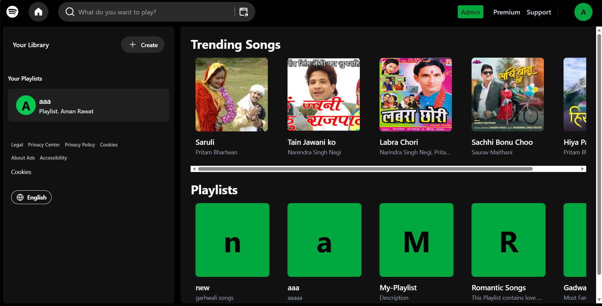

# 🎧 Gadwalify – Spotify Clone (MERN Stack)

Gadwalify is a full-stack music streaming web application inspired by Spotify. It allows users to stream songs seamlessly while providing admin functionalities to manage music content. Built using the MERN stack with modern tools like Redux Toolkit, Tailwind CSS, and Redis caching.

---

## 🚀 Features

### 👤 User (Listener)

* 🎵 Stream songs in real-time
* ⏯️ Play, pause, skip tracks
* 📃 Browse song listings
* ⚡ Fast performance with Redis caching
* 🔐 Secure login with OAuth

### 🛠️ Admin

* ➕ Add new songs
* 🗂️ Manage song library
* 📝 Update or delete tracks

---

## 🧑‍💻 Tech Stack

### Frontend

* React.js
* Tailwind CSS
* Redux Toolkit

### Backend

* Node.js
* Express.js

### Database & Caching

* MongoDB
* Redis (for caching & performance optimization)

### Authentication

* OAuth (Google / third-party login)

---

## 📁 Project Structure

```
project-root/
│── frontend/        # React + Tailwind + Redux
│── backend/         # Node + Express APIs
│── screenshots/     # App screenshots
│── README.md
```

---

## 📸 Screenshots

Add your screenshots in `/screenshots` folder and display like this:

```



```

---

## ⚙️ Installation & Setup

### 1️⃣ Clone the repository

```
git clone https://github.com/your-username/gadwalify.git
cd gadwalify
```

### 2️⃣ Setup Backend

```
cd backend
npm install
npm start
```

### 3️⃣ Setup Frontend

```
cd frontend
npm install
npm run dev
```

---

## 🔐 Environment Variables

Create a `.env` file in backend:

```
MONGO_URI=your_mongodb_connection
REDIS_URL=your_redis_url
OAUTH_CLIENT_ID=your_oauth_client_id
OAUTH_SECRET=your_oauth_secret
JWT_SECRET=your_secret_key
```

---

## 🌐 Live Demo

👉 [https://gadwalify-ns8s.vercel.app/]

---

## 🎯 Key Highlights

* ⚡ Redis caching for faster song loading
* 🔐 Secure authentication using OAuth
* 🎧 Smooth music streaming experience
* 📦 Scalable MERN architecture
* 🎨 Clean UI with Tailwind CSS

---

## 📌 Future Improvements

* Playlist creation
* Like/Favorite songs
* Recently played history
* Recommendation system (AI-based)

---

## 🤝 Contributing

Contributions are welcome! Feel free to fork this repo and submit a pull request.

---

## 📄 License

This project is for educational purposes only.

---

## 🙌 Acknowledgements

Inspired by Spotify UI/UX and modern music streaming platforms.

---

⭐ If you like this project, give it a star on GitHub!
